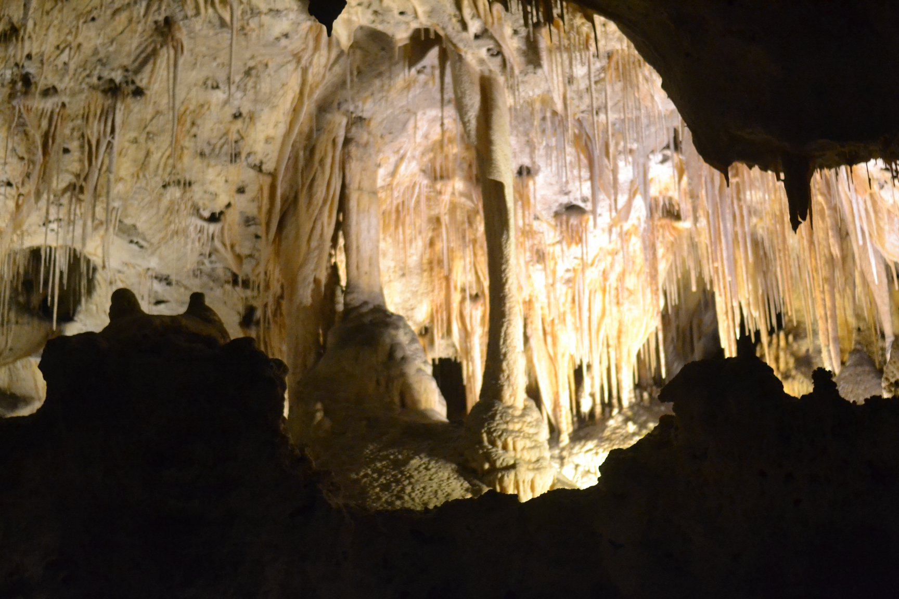
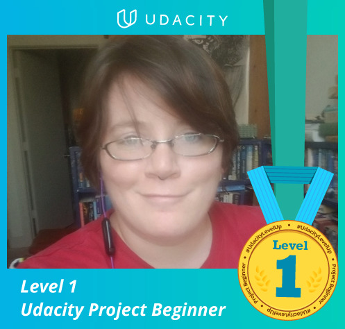

### A lot has happened since my last post
The SARS2-CoV went from being a slightly worrying thing happening in China to drastically changing the world, at least for a time.

I went on a road trip for a week and saw **Carlsbad.**  The hike down into the cave was one of the coolest things I have ever done. At the time of my trip, Covid19 was starting to spread in the US although officials weren't really admitting it.  I considered cancelling my trip because of this but even though I expected things to get bad I thought it was probably early enough that the trip wouldn't increase my risks by much.  Things got bad a lot faster than I expected but it was worth it.  Completely!

My best friend and my adorable goddaughter came and stayed with me for about ten days.  I know, more travelling during the time of coronavirus.  It's terrible, especially considering that I have a background in infectious disease and knew that this was serious long before it was news.  In my defense, even though I knew it was serious it was hard to grasp how serious it would be.  This isn't something that has happened in over a hundred years and no one was really prepared. Having them here was amazing though and I'm glad I got to see them.  And again they were here very early in March before any travel restrictions or any restrictions at all had been implemented so even though we both thought about cancelling we decided that would be an overreaction based on what we knew at the beginning of their trip.  They did end up going home early and by car though because airports and rail travel was starting to look a bit hairy as they neared the end of their stay.  

After they left life started getting wierd.  My partner started working from home and I started not working.  The first week was a hard adjustment.  However, after the first week a lot of my groups started meeting online.  And Udacity gave a free month to anyone who signed up.  I decided to sign up for the Introduction to Machine Learning using TensorFlow.  This is what Udacity calls a nanodegree program meaning it consists of multiple courses.  They suggest taking three months to finish it.  However, since I have a lot of free time comparatively **and** I have a month free, I decided to try to finish it in one month.  So far I'm right on schedule.  There are three (really four but one was just a short intro) courses.  Each course consists of several lessons and ends with a project.  I decided to commit to at least four hours a day and to attempt one course per week.  So far it's Friday of the second week and I should finish all of the lessons of the second course today.  That gives me the weekend to finish the second project.  Wish me luck :)

I'll try to update more and stay safe everyone.

