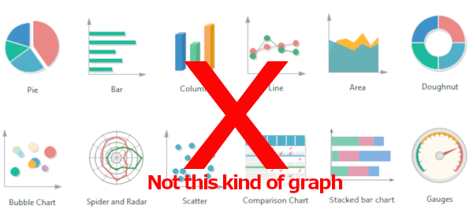

## aka Don't Believe Everything You Read on Medium
### Graphs and Why I Love Them
Lately during my Algorithm Design and Analysis class I have been learning about graphs and different algorithms that relate to them and graphs are quickly becoming my favorite data structure.
#### So, what exactly is a graph?
Graphs can refer to many different things and if you're like me, you are probably thinking of the wrong kind of graph.   In computer science graph doesn't refer to charts or line graphs, it refers to a data structure that consists of variety of nodes or vertices and the edges or connections between them. 
 Because nodes can represent many different things, graphs and graph theory turns out to be really important for solving lots of different problems.  Graphs are a great way to represent networks from social networks like facebook to road networks.  So two applications for graph algorithms that you have probably encountered is the logic that your GPS uses to find a route and the code that facebook uses to suggest possible friends. Graphs can also be used to represent steps in a process, related information, etc and as such are incredibly important for AI/machine learning.
>>> Just in case you're still processing here are some examples of graphs from https://pathmind.com/wiki/graph-analysis
>> * Cities are nodes and highways are edges
>> * Humans are nodes and relationships between them are edges (in a social network)
>> * States are nodes and the transitions between them are edges (for more on states, see our post on deep reinforcement learning). For example, a video game is a graph of states connected by actions that lead from one state to the next…
>> * Atoms are nodes and chemical bonds are edges (in a molecule)
>> * Web pages are nodes and hyperlinks are edges (Hello, Google)
>> * A thought is a graph of synaptic firings (edges) between neurons (nodes)
>> * A neural network is a graph … that makes predictions about other graphs. The nodes are places where computation happens and the edges are the paths by which signal flows through the mathematical operations

#### And why do I love them?
This is a little hard to answer but part of the reason has to do with an algorithm that I had to implement for my class.  The algorithm is called Karger's Min Cut. This algorithm is used to calculate the minimum cut of a graph which is basically where you would cut the graph in half if you wanted to cut the fewest edges.  Min-cuts are very useful for many things.  They can help you identify where to remove a line if you want to disable a regions power or communication network.  They can help you identify friend groups or communities by looking for the min-cuts between people. They can be used for identifying bottlenecks in a process or weak points in a bridge.  They're very cool.  
Karger's algorithm works by picking a random edge and then combining the two nodes it connects into a supernode.  It continues doing this until only two nodes are remaining. Any edges between them must be cut. Here is Karger's in pseudocode:
```java
while there are more than 2 supernodes: do
    Pick an edge (u, v) ∈ E(G) uniformly at random;
    Merge u and v;
Output edges between the remaining two supernodes
```
Because you randomly choose edges this cut is not necessarily a min-cut but it might be.  The key to finding a min-cut is to repeat this process many times and keep track of how many edges must be cut each time.  The smallest value is going to be a min-cut.  
Implementing this algorithm was really fun.  It required a bit of thought as to how I should represent my graph to make this algorithm run as efficiently as possible.  But I was able to get it working pretty easily.  But I'm not going to lie, my first implementation was slooow.  In order to be pretty certain that Karger's will return a true min-cut you have to run it n^2*ln(n) times.  The graph I was testing had 200 nodes so that's about 200,000 times.  Even worse Karger's is at best linear but can as bad as n^2 depending on how it is implemented.  So we end up with an algorithm that runs in n^3ln(n) time.  If you do a good job implementing it. I think my first implementation was a bit worse.  But I had a lot of fun going back and optimizing things and making it faster.  

### Why You Shouldn't Believe Everything You Read On Medium
Even though I really enjoyed implementing and then optimizing my Karger's Min-Cut, at one point I became a bit discouraged. As I was optimizing I was researching online and found an article someone had written about their implementation and they said their algorithm took about 3 seconds to run.  That was much faster than mine so I was sure that I must be doing a terrible job.  
I wanted to see for myself though and since they shared the code they used for edge contraction and calculating the min-cut I decided to try it out on my graph.  They weren't explicit about how they stored their graph but reading their code it was pretty easy to figure it out.  However, as I was doing this I realized something.  Their algorithm did not pick an edge at random!  They had made a mistake and their algorithm was actually biased towards choosing edges belonging to highly connected nodes which made it less likely to produce a min-cut.  It still would eventually but not as often.  Also, when I ran it, it was really very slow.  Much slower than even my first implementation!  I admit I just did deep copy to produce a new graph for each Karger's run and maybe I could have avoided that.  But their code mutated the graph so I'm not sure if they did something different.  They conveniently avoided showing any of the code that created the graph structure or handled the multiple runs of Karger's Min-Cut.  Who knows maybe they just reran Karger's on the same mutated graph? That won't get you min-cut but it is blazingly fast. Whatever the case, I'm pretty certain their claim to speed was not accurate.  


Here is the code they shared if in case you're curious: 
```python
cuts=[]
def kargerMinCut(graph):
    while len(graph) > 2:
         v = random.choice(list(graph.keys()))
         w = random.choice(graph[v])
         contract(graph, v, w)
    mincut = len(graph[list(graph.keys())[0]])
    cuts.append(mincut)
def contract(graph, v, w):
    for node in graph[w]:  # merge the nodes from w to v
         if node != v:  # we dont want to add self-loops
             graph[v].append(node)
         graph[node].remove(w)  # delete the edges to the absorbed 
         if node != v:
              graph[node].append(v)
    del graph[w]  # delete the absorbed vertex 'w'
```

And if you want to see mine you can check it out at [github](https://github.com/meisly/Algorithms/tree/master/Unit3).