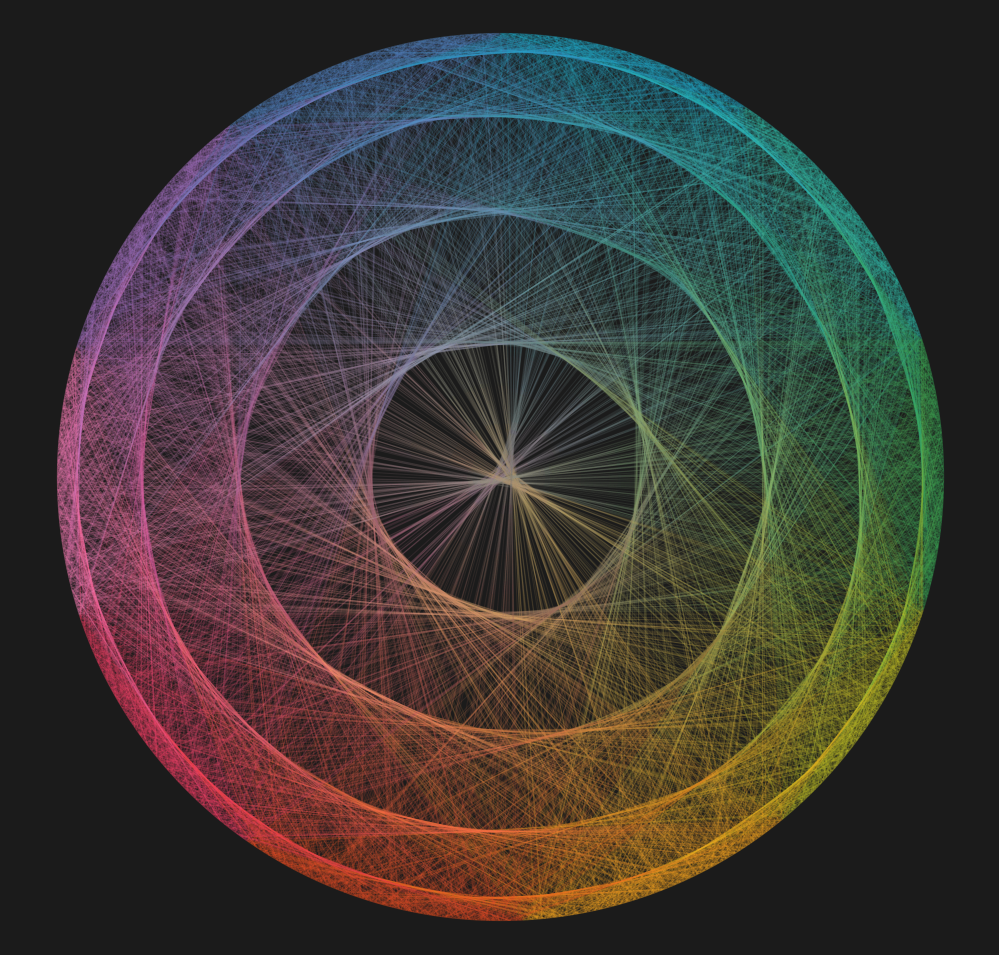

### The Beauty of Pi
 
When I started to redesign my website I knew I wanted to update my background and add some cool visuals and I didn't want to be too cheesy.  So no space themed backgrounds no matter how much they kind of appealed to me.  I decided to try to find some cool open source math visualizations because well Math is cool.  While I was looking I found this really cool website that had just hosts of awesome math and data visualizations.  The site was ["The Ferlange Twins"](https://www.flerlagetwins.com/) and is just a site for Ken and Kevin Ferlange to share their cool data visualizations and Tableau projects like the amazing visualization of the first 5000 digits of pi by Ken that I have above.

Exporing their site I found a lot of really awesome data visualizations including one that looked at the incidence and impact of tornados over time which I will go ahead and link [here](https://www.flerlagetwins.com/2020/01/new-viz-tornado.html).  I have never used Tableau before but I am really impressed with what the Ferlange twins can do with it.  Maybe I'll have to add this to my continuously growing list of cool stuff to learn.

